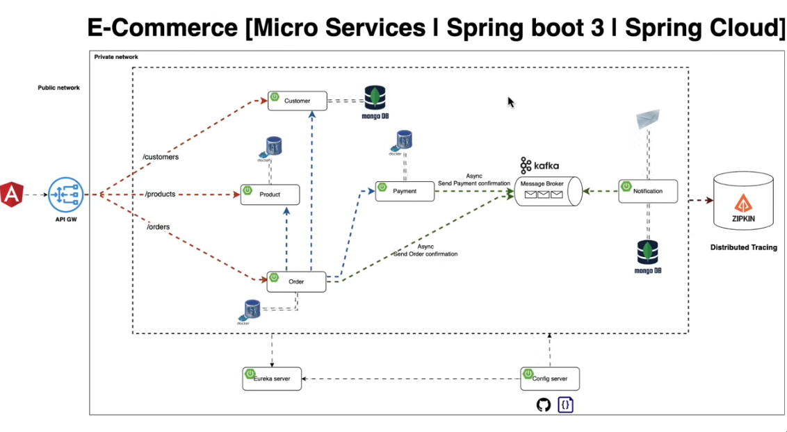
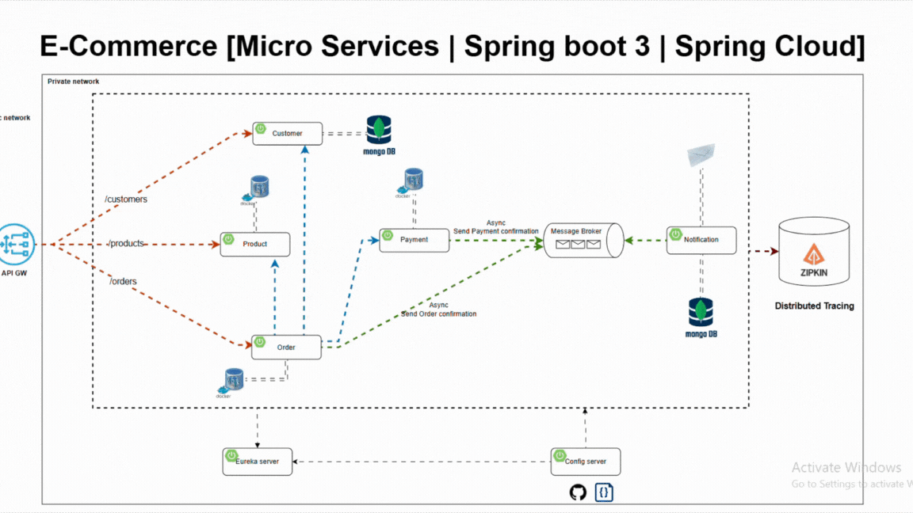

#  Event-Driven Microservices Architecture using Spring Cloud & Apache Kafka, with comprehensive testing & CI/CD.

---

##  Architecture Overview

### Core Services
- **Customer Service** — user management (DDD)
- **Product Service** — catalog & inventory
- **Order Service** — order orchestration
- **Payment Service** — payment processing
- **Notification Service** — async email notifications (Kafka)

### Infrastructure Components
- **API Gateway** — Spring Cloud Gateway (OAuth2 / Keycloak)
- **Service Discovery** — Netflix Eureka
- **Config Server** — centralized configuration
- **Distributed Tracing** — Zipkin

---

##  Technical Architecture

### 1. Domain-Driven Design (DDD)

### 2. Event-Driven Architecture

**Communication Patterns:**
- **Synchronous**: REST / HTTP
- **Asynchronous**: Kafka Events

---

##  Technology Stack

### ✅ Backend

| Layer | Technology |
|-------|-----------|
| **Framework** | Spring Boot 3.2, Spring Cloud 2023 |
| **Communication** | Apache Kafka, OpenFeign, RestTemplate |
| **Security** | Keycloak OAuth2, JWT |
| **Gateway** | Spring Cloud Gateway (WebFlux) |
| **Service Discovery** | Netflix Eureka |
| **Tracing** | Zipkin, Micrometer |
| **Database** | PostgreSQL, MongoDB |
| **Migration** | Flyway |
| **Validation** | Hibernate Validator |
| **Email** | JavaMailSender, Thymeleaf |

---

### ✅ Software Testing

| Component | Technology |
|-----------|-----------|
| **Unit Tests** | JUnit 5, Mockito, AssertJ |
| **Integration Tests** | Spring Boot Test, TestContainers |
| **API Tests** | REST Assured, Postman/Newman |
| **Performance** | Apache JMeter |
| **Coverage** | JaCoCo |
| **CI/CD** | GitHub Actions |

---

## Key Features

### 1. Centralized Configuration with Spring Cloud Config Server
### 2. API Gateway with Load Balancing
### 3. Kafka Event-Driven Communication
### 4. Security & Authentication
### 5. Distributed Tracing with Zipkin
### 6. Synchronous & Asynchronous Communication

---

## 🔄 CI/CD Pipeline

- ✅ Automated unit tests on push
- ✅ JaCoCo coverage reports
- ✅ GitHub Pages dashboard deployment
- 🔄 Postman/Newman API tests (in progress)
- 🔄 JMeter performance tests (in progress)

---
